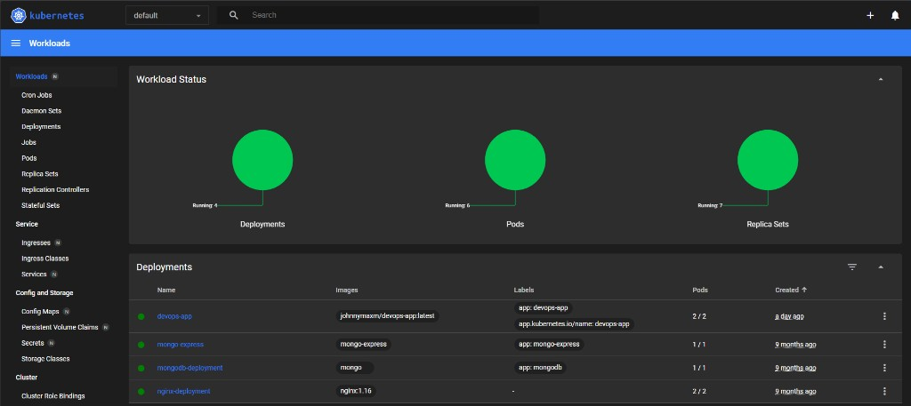
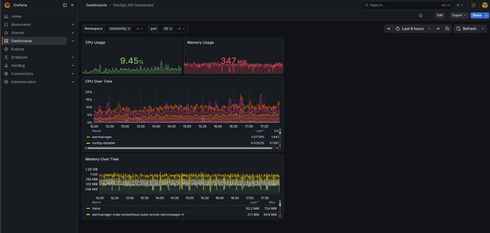
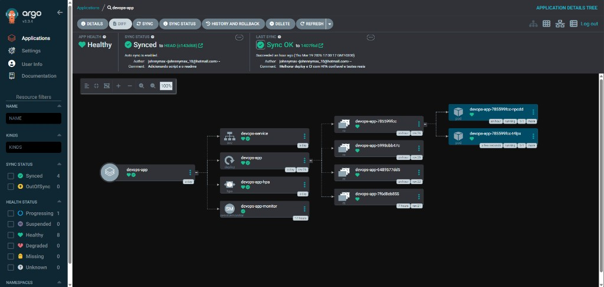

# DevOps-completo

Portfolio de DevOps: aplicacao Node.js com metrics Prometheus, containerizacao com Docker e deploy automatizado no Kubernetes com HPA (autoscaling) e GitOps (Argo CD).

## Visao geral

Este projeto entrega uma aplicacao web simples (Express) com endpoint de metrics para Prometheus (`/metrics`) e um conjunto de manifests Kubernetes para:

- Deploy da aplicacao (`k8s/deployment.yaml`)
- Exposicao via Service (`k8s/service.yaml`)
- Autoescalonamento por HPA com base em CPU (`k8s/hpa.yaml`)
- Integracao com Prometheus usando `ServiceMonitor` (requer Prometheus Operator) (`k8s/servicemonitor.yaml`)
- GitOps com Argo CD apontando para o diretorio `k8s/` (`gitops/application.yaml`)

## Screenshots do projeto

### Kubernetes Dashboard (workloads)



### Grafana - DevOps API Dashboard



### Argo CD - Aplicacao sincronizada



## Tecnologias

- Aplicacao: Node.js + Express
- Observabilidade: `prom-client` (Prometheus metrics)
- Container: Docker
- Kubernetes: Deployment, Service, HPA, ServiceMonitor
- GitOps: Argo CD
- CI/CD: GitHub Actions (testes + build + push de imagem)

## Como o HPA funciona

O HPA usa `metrics` do tipo `Resource` com alvo de CPU por utilizacao media (`averageUtilization`).

Para o HPA funcionar corretamente, o Deployment define `resources.requests` (principalmente `cpu`) em `k8s/deployment.yaml`. Isso permite que o Kubernetes calcule a utilizacao de CPU e aplique o autoscaling entre `minReplicas` e `maxReplicas`.

## Estrutura do repositorio

- `app/`
  - `server.js`: servidor Express com endpoints `/` e `/metrics`
  - `package.json`: scripts de `start` e `test`
  - `test/server.test.js`: testes simples (rodando com `node --test`)
- `Dockerfile`: build da imagem da aplicacao
- `k8s/`
  - `deployment.yaml`: Deployment do app (com probes, resources e securityContext)
  - `service.yaml`: Service ClusterIP para expor a porta do container
  - `hpa.yaml`: HorizontalPodAutoscaler baseado em CPU
  - `servicemonitor.yaml`: ServiceMonitor para Prometheus Operator
- `gitops/application.yaml`: manifest do Argo CD para sincronizar a pasta `k8s/`
- `.github/workflows/ci.yml`: pipeline CI (testes + build + push)
- `.dockerignore`: reduz o contexto de build

## Como foi feito (alto nivel)

1. A aplicacao expoe metrics no formato Prometheus em `GET /metrics`.
2. A imagem e construida com `Dockerfile` usando instalacao reprodutivel (`npm ci`).
3. O deploy foi projetado e validado em ambiente local com `minikube`, usando manifests Kubernetes em `k8s/`.
4. O autoscaling e controlado pelo HPA com base em CPU (`k8s/hpa.yaml`).
5. O CI do GitHub Actions roda testes e faz build/push da imagem.
6. A camada GitOps e feita pelo Argo CD, sincronizando o diretorio `k8s/`.

## Como usar (testar em casa)

Voce tem duas formas: (A) testar so com Docker (rapido) ou (B) testar com Kubernetes (mais proximo do que esta no portfolio).

### Requisitos

Escolha a opcao que voce quer usar:

Opcao A (Docker):
- Docker instalado

Opcao B (Kubernetes):
- Docker instalado
- `kubectl` configurado
- Um cluster local (recomendado: `kind` ou `minikube`)
- (Opcional para metrics e monitora) Prometheus Operator instalado para que o `ServiceMonitor` funcione
- (Opcional para HPA por CPU) `metrics-server` instalado (recomendado para HPA)

### Opcao A: Rodar com Docker

1. Build da imagem:

```bash
docker build -t devops-app:local .
```

2. Rodar:

```bash
docker run --rm -p 3000:3000 devops-app:local
```

3. Testar endpoints:

```bash
curl http://localhost:3000/
curl http://localhost:3000/metrics
```

### Opcao B: Rodar com Kubernetes (minikube)

1. Inicie o minikube:

```bash
minikube start
```

2. Garanta o `metrics-server` instalado (recomendado para HPA). Sem isso, o HPA pode ficar sem dados de CPU.

3. Execute o script de deploy com fallback de imagem:

```bash
bash scripts/deploy-minikube.sh
```

Esse script aplica os manifests e tenta primeiro a imagem remota `johnnymaxm/devops-app:latest`.
Se o pull falhar ou o rollout nao concluir, ele faz fallback automatico para a imagem local default `devops-app:local` (buildada dentro do ambiente Docker do minikube).

4. Verifique:

```bash
kubectl get deploy
kubectl get pods
kubectl get hpa
kubectl get svc
```

5. Teste a rota principal via Service:

- Se voce usar `kubectl port-forward`:

```bash
kubectl port-forward svc/devops-service 3000:80
curl http://localhost:3000/
curl http://localhost:3000/metrics
```

### Observabilidade (Prometheus)

O arquivo `k8s/servicemonitor.yaml` e para uso com Prometheus Operator (CRD `ServiceMonitor`).

Se voce ja utiliza um stack como `kube-prometheus-stack`, o `ServiceMonitor` deve ser reconhecido automaticamente.

Se nao tiver Prometheus Operator no cluster, voce pode:

- Remover/ignorar o `servicemonitor.yaml`, e validar apenas o endpoint `/metrics` via `kubectl port-forward`
- Ou instalar um stack de Prometheus com Operator (para habilitar o `ServiceMonitor`)

### Explicacao rapida: Prometheus "com" e "sem" Operator

- Com Operator: voce aplica `ServiceMonitor` e o Prometheus descobre o app automaticamente.
- Sem Operator: o recurso `ServiceMonitor` nao existe no cluster, entao voce coleta metricas manualmente (por `scrape_configs`) ou apenas valida `GET /metrics`.
- Para portfolio: manter `ServiceMonitor` mostra maturidade de observabilidade para ambiente real.

### Abrir Grafana e ver dashboards

Se voce estiver usando `kube-prometheus-stack` no namespace `monitoring`, pode abrir o Grafana assim:

1. Descobrir o nome do Service do Grafana:

```bash
kubectl get svc -n monitoring | grep grafana
```

2. Fazer port-forward (ajuste o nome do service conforme a saida do comando acima):

```bash
kubectl port-forward -n monitoring svc/kube-prometheus-stack-grafana 3001:80
```

3. Abrir no navegador:

- URL: `http://localhost:3001`

4. Credenciais padrao mais comuns:

- usuario: `admin`
- senha: `prom-operator`

Se essas credenciais nao funcionarem, recupere a senha do secret:

```bash
kubectl get secret -n monitoring kube-prometheus-stack-grafana -o jsonpath="{.data.admin-password}" | base64 --decode; echo
```

#### Dashboard do app

O dashboard ja esta criado com o nome:

- `DevOps API Dashboard`

Depois de logar no Grafana:

- va em **Dashboards > Browse**
- pesquise por `DevOps API Dashboard`
- abra o dashboard e selecione o datasource Prometheus configurado no ambiente

Dica: para validar ingestao de metricas rapidamente, confira no dashboard se a metrica `process_cpu_user_seconds_total` esta retornando dados para o app `devops-app`.

## Testes da aplicacao

Rodando localmente:

```bash
cd app
npm ci
npm test
```

## CI/CD (GitHub Actions)

O pipeline em `.github/workflows/ci.yml` faz:

- Checkout do repositorio
- Setup de Node
- Instalacao via `npm ci`
- Execucao de testes (`npm test`)
- Build da imagem Docker com tag por `github.sha` e tag `latest`
- Push para o Docker Hub (usando secrets `DOCKER_USERNAME` e `DOCKER_PASSWORD`)

## Notas

- O `Deployment` define `resources` (requests/limits), `readinessProbe`, `livenessProbe` e `securityContext` para estabilidade e seguranca.
- O HPA esta configurado com comportamento de scale up/down via `behavior` em `k8s/hpa.yaml`.

## Resultado esperado no minikube

- App respondendo em `GET /`
- Metrics expostas em `GET /metrics`
- Deployment em estado `Available`
- HPA criado e monitorando CPU